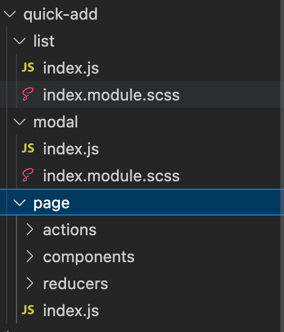
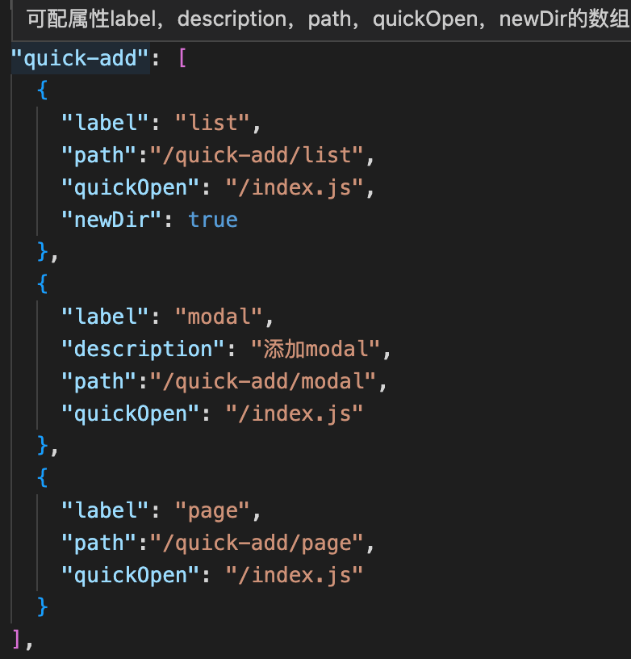
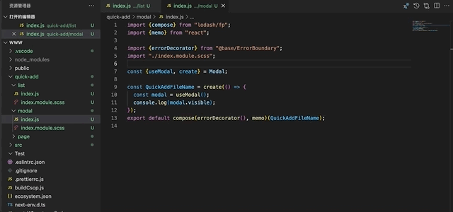

## 配置示例

> 模板文件



> setting.json



- quick-add
  - label: 命令的名称（必填）
  - description：命令的描述（可选）
  - path： 该命令对应的模板路径（必填）
  - quickOpen： 新建文件完成后快速打开的文件路径（可选，相对于文件模板的路径）
  - newDir：boolean，是否新建文件夹（可选）
- quick-add-name-constant
  - constant: 变量的名称
  - rule: 替换的规则，参考文件目录替换的枚举
  - relativePath: 模块相对于当前执行目录的相对位置
  - absolutePath： 绝对路径（优先）,取绝对路径后面的目录名称

> newDir 新建文件夹


> 添加文件



## 文件目录替换

暴露五种文件名的格式去替换

```js
import _ from 'lodash';

const handleFileName = {
  QuickAddFileName: (name) => _.upperFirst(_.camelCase(name)),
  quickAddFileName: (name) => _.camelCase(name),
  quickaddfilename: (name) => _.toLower(name),
  QUICKADDFILENAME: (name) => _.toUpper(name),
  'quick-add-file-name': (name) => _.kebabCase(name),
  quick_add_file_name: (name) => _.snakeCase(name),
};
```
